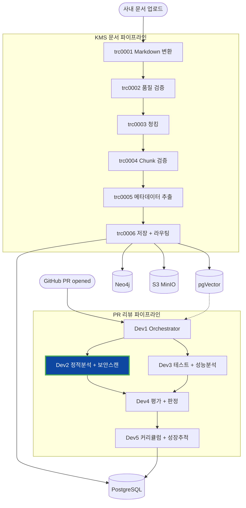
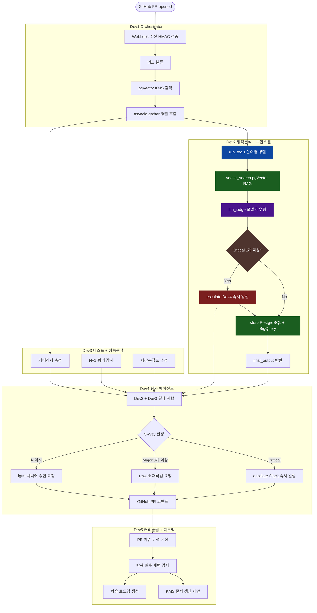
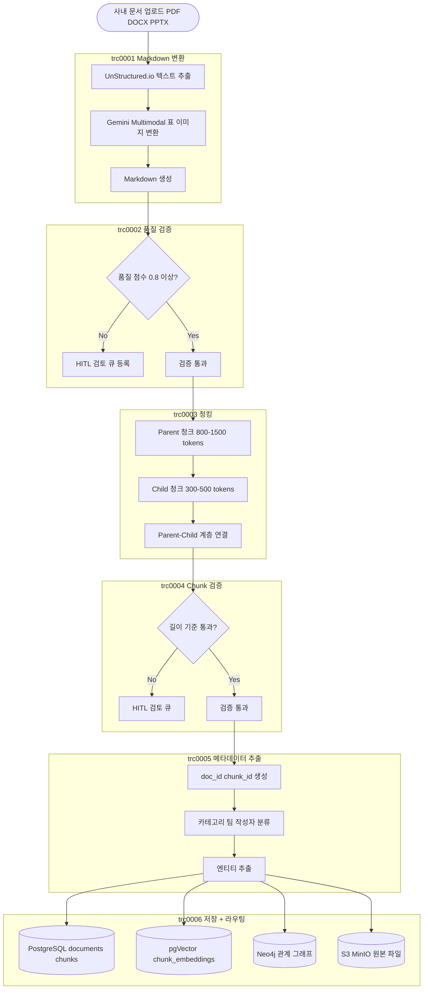
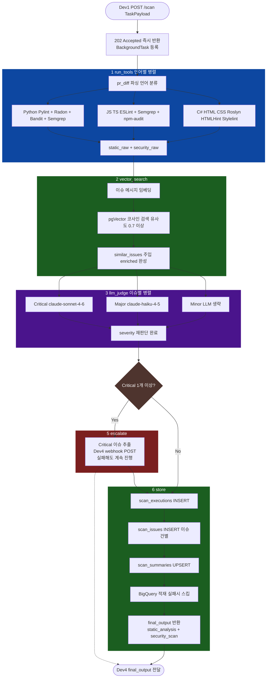

# Task-Link 전체 워크플로우

---

## 1. 시스템 전체 흐름

```mermaid
flowchart TD
    T1([GitHub PR opened])
    T2([사내 문서 업로드])

    subgraph PIPELINE1[PR 리뷰 파이프라인]
        P1[Dev1 Orchestrator]
        P2[Dev2 정적분석 + 보안스캔]
        P3[Dev3 테스트 + 성능분석]
        P4[Dev4 평가 + 판정]
        P5[Dev5 커리큘럼 + 성장추적]
    end

    subgraph PIPELINE2[KMS 문서 파이프라인]
        K1[trc0001 Markdown 변환]
        K2[trc0002 품질 검증]
        K3[trc0003 청킹]
        K4[trc0004 Chunk 검증]
        K5[trc0005 메타데이터 추출]
        K6[trc0006 저장 + 라우팅]
    end

    DB1[(PostgreSQL)]
    DB2[(pgVector)]
    DB3[(Neo4j)]
    DB4[(S3 MinIO)]

    T1 --> P1 --> P2 & P3
    P2 & P3 --> P4 --> P5
    T2 --> K1 --> K2 --> K3 --> K4 --> K5 --> K6
    K6 --> DB1 & DB2 & DB3 & DB4
    DB2 -.-> P1
    P5 --> DB1

    style P2 fill:#0D47A1,color:#fff,stroke:#4CAF50,stroke-width:3px
```

---

## 2. PR 리뷰 파이프라인 상세

```mermaid
flowchart TD
    A([GitHub PR opened])

    subgraph DEV1[Dev1 Orchestrator]
        B[Webhook 수신 HMAC 검증]
        C[의도 분류]
        D[pgVector KMS 검색]
        E[asyncio.gather 병렬 호출]
    end

    subgraph DEV2[Dev2 정적분석 + 보안스캔]
        F1[run_tools 언어별 병렬]
        F2[vector_search pgVector RAG]
        F3[llm_judge 모델 라우팅]
        F4{Critical 1개 이상?}
        F5[escalate Dev4 즉시 알림]
        F6[store PostgreSQL + BigQuery]
        F7[final_output 반환]
    end

    subgraph DEV3[Dev3 테스트 + 성능분석]
        G1[커버리지 측정]
        G2[N+1 쿼리 감지]
        G3[시간복잡도 추정]
    end

    subgraph DEV4[Dev4 평가 에이전트]
        H1[Dev2 + Dev3 결과 취합]
        H2{3-Way 판정}
        H3[lgtm 시니어 승인 요청]
        H4[rework 재작업 요청]
        H5[escalate Slack 즉시 알림]
        H6[GitHub PR 코멘트]
    end

    subgraph DEV5[Dev5 커리큘럼 + 피드백]
        I1[PR 이슈 이력 저장]
        I2[반복 실수 패턴 감지]
        I3[학습 로드맵 생성]
        I4[KMS 문서 갱신 제안]
    end

    A --> B --> C --> D --> E
    E --> F1 & G1
    G1 & G2 & G3 --> H1
    F1 --> F2 --> F3 --> F4
    F4 -- Yes --> F5 --> F6
    F4 -- No --> F6
    F6 --> F7
    F5 -.-> H1
    F7 --> H1
    H1 --> H2
    H2 -- Critical --> H5
    H2 -- Major 3개 이상 --> H4
    H2 -- 나머지 --> H3
    H3 & H4 & H5 --> H6 --> I1
    I1 --> I2 --> I3
    I2 --> I4

    style F1 fill:#0D47A1,color:#fff,stroke:none
    style F2 fill:#1B5E20,color:#fff,stroke:none
    style F3 fill:#4A148C,color:#fff,stroke:none
    style F4 fill:#4E342E,color:#fff,stroke:none
    style F5 fill:#7B1F1F,color:#fff,stroke:none
    style F6 fill:#1B5E20,color:#fff,stroke:none
```

---

## 3. KMS 문서 파이프라인 상세

```mermaid
flowchart TD
    A([사내 문서 업로드 PDF DOCX PPTX])

    subgraph S1[trc0001 Markdown 변환]
        B1[UnStructured.io 텍스트 추출]
        B2[Gemini Multimodal 표 이미지 변환]
        B3[Markdown 생성]
    end

    subgraph S2[trc0002 품질 검증]
        C1{품질 점수 0.8 이상?}
        C2[HITL 검토 큐 등록]
        C3[검증 통과]
    end

    subgraph S3[trc0003 청킹]
        D1[Parent 청크 800-1500 tokens]
        D2[Child 청크 300-500 tokens]
        D3[Parent-Child 계층 연결]
    end

    subgraph S4[trc0004 Chunk 검증]
        E1{길이 기준 통과?}
        E2[HITL 검토 큐]
        E3[검증 통과]
    end

    subgraph S5[trc0005 메타데이터 추출]
        F1[doc_id chunk_id 생성]
        F2[카테고리 팀 작성자 분류]
        F3[엔티티 추출]
    end

    subgraph S6[trc0006 저장 + 라우팅]
        G1[(PostgreSQL documents chunks)]
        G2[(pgVector chunk_embeddings)]
        G3[(Neo4j 관계 그래프)]
        G4[(S3 MinIO 원본 파일)]
    end

    A --> B1 --> B2 --> B3 --> C1
    C1 -- No --> C2
    C1 -- Yes --> C3 --> D1 --> D2 --> D3 --> E1
    E1 -- No --> E2
    E1 -- Yes --> E3 --> F1 --> F2 --> F3
    F3 --> G1 & G2 & G3 & G4
```

---

## 4. Dev2 내부 파이프라인 상세

```mermaid
flowchart TD
    A([Dev1 POST /scan TaskPayload])
    B[202 Accepted 즉시 반환\nBackgroundTask 등록]

    subgraph N1[1 run_tools 언어별 병렬]
        C[pr_diff 파싱 언어 분류]
        D1[Python Pylint + Radon + Bandit + Semgrep]
        D2[JS TS ESLint + Semgrep + npm-audit]
        D3[C# HTML CSS Roslyn HTMLHint Stylelint]
        E[static_raw + security_raw]
    end

    subgraph N2[2 vector_search]
        F[이슈 메시지 임베딩]
        G[pgVector 코사인 검색 유사도 0.7 이상]
        H[similar_issues 주입 enriched 완성]
    end

    subgraph N3[3 llm_judge 이슈별 병렬]
        I[Critical claude-sonnet-4-6]
        J[Major claude-haiku-4-5]
        K[Minor LLM 생략]
        L[severity 재판단 완료]
    end

    N4{Critical 1개 이상?}

    subgraph N5[5 escalate]
        M[Critical 이슈 추출\nDev4 webhook POST\n실패해도 계속 진행]
    end

    subgraph N6[6 store]
        O[scan_executions INSERT]
        P[scan_issues INSERT 이슈 건별]
        Q[scan_summaries UPSERT]
        R[BigQuery 적재 실패시 스킵]
        S[final_output 반환\nstatic_analysis + security_scan]
    end

    OUT([Dev4 final_output 전달])

    A --> B --> C
    C --> D1 & D2 & D3 --> E
    E --> F --> G --> H
    H --> I & J & K --> L --> N4
    N4 -- Yes --> M --> O
    N4 -- No --> O
    M -.-> OUT
    O --> P --> Q --> R --> S --> OUT

    style N1 fill:#0D47A1,color:#fff,stroke:none
    style N2 fill:#1B5E20,color:#fff,stroke:none
    style N3 fill:#4A148C,color:#fff,stroke:none
    style N4 fill:#4E342E,color:#fff,stroke:none
    style N5 fill:#7B1F1F,color:#fff,stroke:none
    style N6 fill:#1B5E20,color:#fff,stroke:none
```
